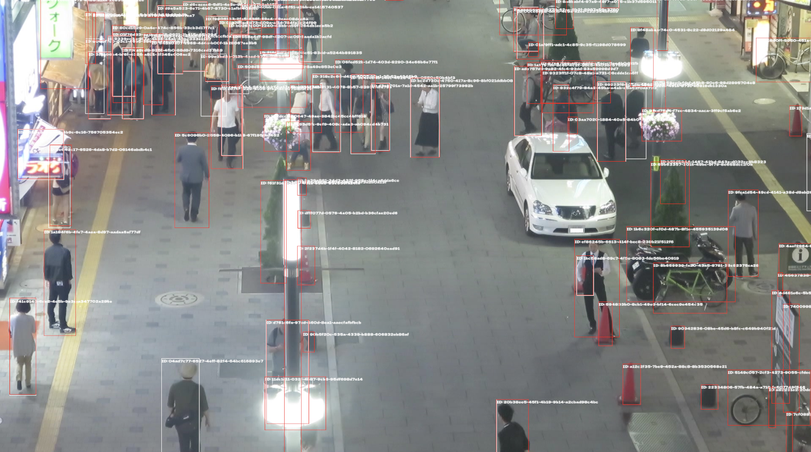

# motrs

## Overview

motrs is a multi-object tracking library written in Rust, inspired by
[motpy](https://github.com/wmuron/motpy). Give it the bounding boxes observed in
each frame; it associates them with existing objects, returns tracking IDs, and
predicts positions when detections are temporarily missing.

It runs in native Rust applications and in the browser through WebAssembly.
This is useful when you already have detections from a camera model, a simulation,
or another source and want to follow objects over time.

## What is implemented

- Kalman filtering with static, constant-velocity, or constant-acceleration models.
- Hungarian assignment using intersection over union (IoU), with optional
  appearance vectors for matching.
- Configurable frame interval, matching threshold, track confirmation, and lifetime
  for missing detections. New objects can enter at any frame.
- Axis-aligned bounding boxes with configurable dimensions, including 2D and 3D.
- Input validation and track metadata such as score, supplied class ID, and missed
  frame count.
- A browser playground with random obstacles, different object speeds and motion
  patterns, live object additions, and observed/predicted track displays.
- Native simulation and MOT16 viewers, tests, and benchmark code.

## What is not implemented

- Image-based object detection or automatic class recognition. You supply detections
  and any class labels; the library assigns tracking IDs.
- Direct tracking of polygons, segmentation masks, or rotated boxes. Complex shapes
  can be represented by their axis-aligned bounding boxes.
- Guaranteed identity recovery after occlusion or crossings. Abrupt turns, fast
  motion, overlapping boxes, and long detection gaps can produce new IDs or ID switches.
- A published accuracy or performance evaluation. The MOT16 example visualizes
  annotation boxes as observations; it does not compute MOT metrics.
- A tracking backend service. The browser example runs tracking locally in WebAssembly;
  its development server serves the page and build assets.

## Quick start

Install Rust through rustup. From the repository root, the following commands use
the toolchain pinned in [rust-toolchain.toml](rust-toolchain.toml):

```sh
rustup show
cargo run --locked -p motrs --example simple
```

The example prints an object's tracking ID and estimated box for each frame.
For another Rust application, add a Cargo path dependency pointing to the
[`motrs/`](motrs) directory in this checkout.

### Rust usage

```rust
use motrs::{BoundingBox, Detection, Error, MultiObjectTracker, TrackerConfig};

fn main() -> Result<(), Error> {
    let mut tracker = MultiObjectTracker::new(TrackerConfig {
        dt: 0.1, // One frame every 0.1 seconds.
        max_missed_frames: 20,
        ..Default::default()
    })?;

    for frame in 0..10 {
        let x = 10.0 + frame as f32;
        // Corners: [left, top], [right, bottom].
        let bounds = BoundingBox::new([x, 20.0], [x + 20.0, 40.0])?;
        let tracks = tracker.step([Detection::new(bounds)])?;
        for track in tracks {
            println!("{}: {:?}", track.id, track.bounds);
        }
    }

    // Advance one frame with no observations; existing tracks are predicted.
    let predicted = tracker.step(Vec::<Detection>::new())?;
    println!("Predicted tracks: {}", predicted.len());
    Ok(())
}
```

Pass all detections for a frame in one `step` call. To add an object, include its
box alongside the other observations in a later frame. Unmatched detections start
new tracks; unmatched tracks survive up to `max_missed_frames` consecutive misses.
For 2D boxes, use finite coordinates with `right > left` and `bottom > top`.

### Browser usage

You also need Node.js, npm, and wasm-pack. If wasm-pack is not installed:

```sh
cargo install wasm-pack --locked
```

From the repository root:

```sh
cd motrs_wasm
npm ci
npm run serve
```

Open [http://127.0.0.1:8080](http://127.0.0.1:8080) after the WebAssembly and
webpack builds finish. Keep the command running while using the demo.

1. Set the initial ball count (0–50), object size, minimum/maximum speed, and motion.
2. Choose the number, size, and shapes of obstacles: squares, stars, circles, and triangles.
3. Set the random seed and track lifetime, then click **Apply & restart**.
4. Select a new object's shape and motion, then click **+ Add object** or click the
   canvas to place it. Existing tracks continue; the scene supports up to 50 objects.
5. Use **Pause**, **Step one frame**, and the missing-detection controls to inspect
   tracking. Solid boxes show observed tracks; dashed boxes show predicted tracks.

Objects have independently sampled speeds. Motion can be straight with wall bounces,
wandering, or erratic. Speeds are measured in canvas pixels per frame at 10 frames
per second. Obstacles hide detections when an object's center is inside their shape;
they do not cause collisions. The simulation supplies boxes to the actual Rust tracker.

Settings are saved in browser local storage. **Apply & restart** rebuilds the scene
and tracker with the edited settings; **Shuffle & restart** chooses a new seed.
Reusing a seed reproduces the simulated scene, but generated tracking IDs can differ.
Objects added during playback are not saved across page reloads.

To inspect the JavaScript interface, expand **Inspect this frame's input and output**
in the demo. Its basic usage is:

```javascript
import init, { MOT } from "./pkg";

await init();
const tracker = MOT.with_max_missed_frames(20);
tracker.step([{ _box: [10, 20, 30, 40] }]); // left, top, right, bottom
console.log(tracker.active_tracks()); // id, _box, score, class_id, missed_frames
tracker.step([]); // Advance a frame without detections.
tracker.free();
```

`npm run build` generates the browser example in `motrs_wasm/dist/` for serving
over HTTP. These scripts currently build development artifacts.

## More examples and checks

Run the native 2D simulation from the repository root:

```sh
cargo run --locked -p multi_object_2d_tracking
```

For the dataset viewer and download instructions, see the
[MOT16 example README](motrs/examples/mot16_challenge/README.md).



Run the core and WebAssembly facade tests, or generate the Rust API documentation:

```sh
cargo test --locked -p motrs -p motrs_wasm
cargo doc --locked -p motrs --no-deps
```

## License

[MIT](LICENSE).
